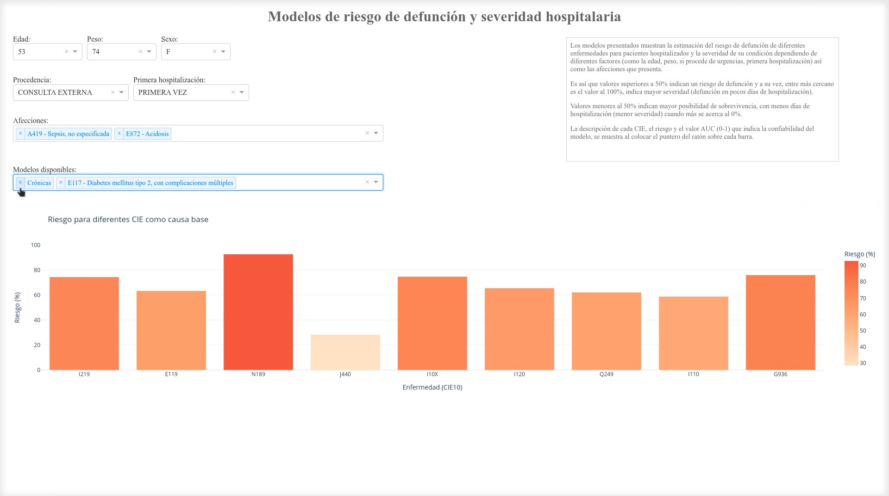

# Sistema web para la modelización del riesgo de defunción y la severidad hospitalaria asociada a afecciones médicas
El sistema desarrollado permite modelar el riesgo de defunción y severidad hospitalaria asociada a diferentes afecciones médicas en pacientes hospitalizados. El modelo estadístico toma en cuenta diferentes factores, como la edad, peso, procedencia, primera hospitalización y las afecciones presentadas por el paciente para estimar el riesgo de defunción y la severidad de la condición del paciente.

Valores superiores a 50% indican un mayor riesgo de defunción y mayor severidad, mientras que valores menores al 50% indican mayor posibilidad de sobrevivencia y menor severidad. Es importante mencionar que el sistema no se utiliza para determinar los riesgos de pacientes específicos, sino que es un modelado estadístico para estudiar cómo interactúan conjuntamente los diferentes factores en cada enfermedad, en hospitalizaciones que ocurren dentro de la Zona del Valle de México.

El modelo final es un modelo ponderado de Gradient Boosting Models (GBM), Árboles de Regresión y Regresión Logística. El archivo PICKLE original de los modelos **no se incluye por razones de privacidad de los datos**, en cambio se incluye un archivo PICKLE generado a partir de **datos sintéticos**.

**Proyecto CONACyT**: Observatorio de datos para descubrimientos de patrones Sociales-EspacioTemporales en Salud, Movilidad y Calidad del Aire.

**Número**: 7051.

**Objetivo**: Definir las bases de interoperabilidad para homologar la información de las bases de datos de salud, y obtener datos precisos y confiables, que permitan tener series históricas y generar la trazabilidad de los pacientes, en especial de aquellos que padecen enfermedades crónicas no transmisibles, así como la construcción de indicadores de salud y su relación con la exposición a contaminantes atmosféricos. 


## Uso
Ejecutar `ipython dash_afecciones.py`




## Requisitos
`pip install -r requirements.txt`

[Archivo requirements.txt](requirements.txt)

### Lista de archivos
[dash_afecciones.py](dash_afecciones.py): Código Python para generar el dashboard de modelos predictivos para la severidad hospitalaria.

[risk_models-rnd.pickle](risk_models-rnd.pickle): Archivo PICKLE de los modelos generados a partir de datos sintéticos.	

[dash_afecciones.mp4](dash_afecciones.mp4): Video del funcionamiento del dashboard de modelos predictivos para la severidad hospitalaria.	


### Repositorios relacionados
[Generación automatizada de modelos predictivos del número y severidad de las hospitalizaciones](https://github.com/cminuttim/modelos_hosp)


## Cita

Por favor, cite el repositorio si utiliza los datos o el código de este repositorio.
```
@misc{dash_riesgo_afec,
  author = {Carlos Minutti},
  title = {Sistema web para la modelización del riesgo de defunción y la severidad hospitalaria asociada a afecciones médicas},
  year = {2023},
  publisher = {GitHub},
  journal = {GitHub repository},
  howpublished = {\url{https://github.com/cminuttim/dash_riesgo_afec}},
}
```
